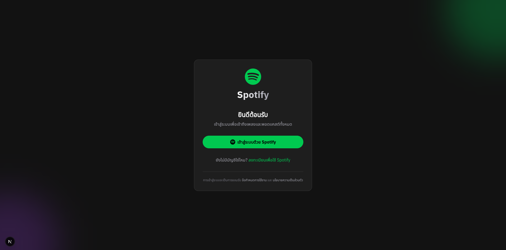
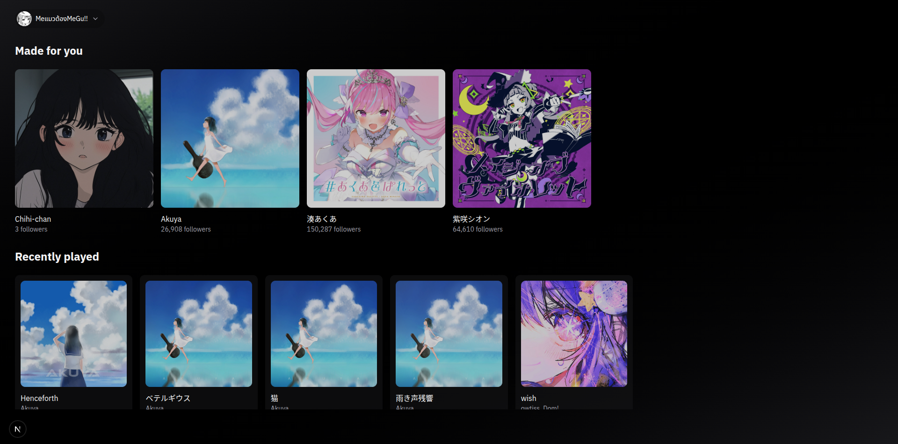
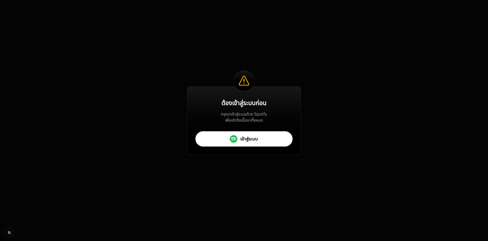

# Spotify-Web-Player

โปรเจคนี้เป็นเว็บแอปพลิเคชันสำหรับแสดงข้อมูลและสถิติต่างๆ จากบัญชี Spotify ของคุณ สร้างขึ้นโดยใช้ Next.js และเชื่อมต่อกับ Spotify API เพื่อดึงข้อมูล

## ✨ คุณสมบัติหลัก (Features)

- **ดูข้อมูลโปรไฟล์:** แสดงข้อมูลโปรไฟล์ Spotify ของคุณ
- **เพลงที่กำลังเล่น:** แสดงเพลงที่กำลังเล่นอยู่ในปัจจุบัน
- **ศิลปินยอดนิยม:** ดูรายชื่อศิลปินที่คุณฟังบ่อยที่สุด
- **ประวัติการฟัง:** ย้อนดูเพลงที่คุณเพิ่งฟังไปล่าสุด
- **จัดการอุปกรณ์:** ดูรายการอุปกรณ์ที่พร้อมเล่นเพลง

## 📸 ภาพหน้าจอ (Screenshots)

<table>
  <tr>
    <td align="center">หน้าเข้าสู่ระบบ</td>
    <td align="center">หน้าหลัก</td>
    <td align="center">Modal บังคับให้เข้าสู่ระบบ</td>
  </tr>
  <tr>
    <td></td>
    <td></td>
    <td></td>
  </tr>
</table>

## 🚀 เทคโนโลยีที่ใช้ (Tech Stack)

- **Framework:** [Next.js](https://nextjs.org/)
- **Language:** [TypeScript](https://www.typescriptlang.org/)
- **Styling:** [Tailwind CSS](https://tailwindcss.com/)
- **Data Fetching:** [Axios](https://axios-http.com/)
- **API:** [Spotify Web API](https://developer.spotify.com/documentation/web-api)

## 🛠️ การติดตั้งและใช้งาน (Getting Started)

ทำตามขั้นตอนต่อไปนี้เพื่อติดตั้งและรันโปรเจคบนเครื่องของคุณ

### สิ่งที่ต้องมี (Prerequisites)

- Node.js (v18.x หรือสูงกว่า)
- Bun

### ขั้นตอนการติดตั้ง

1.  **Clone a repository:**

    ```bash
    git clone https://github.com/NekoSakuraLucia/Spotify-Web-Player
    cd Spotify-Web-Player
    ```

2.  **ติดตั้ง Dependencies:**

    ```bash
    bun install
    ```

3.  **ตั้งค่า Environment Variables:**

    - สร้างไฟล์ `.env.local` ที่ root ของโปรเจค
    - ไปที่ Spotify Developer Dashboard เพื่อสร้างแอปพลิเคชันและรับ `Client ID` และ `Client Secret`
    - ในหน้าตั้งค่าของแอปบน Spotify Dashboard, เพิ่ม `http://127.0.0.1:3000/api/auth/callback` ในส่วนของ Redirect URIs
    - คัดลอกเนื้อหาด้านล่างไปวางในไฟล์ `.env.local` และแทนที่ด้วยข้อมูลของคุณ:

        ```env
        # Spotify Provider
        SPOTIFY_CLIENT_ID='' # Client Id จาก spotify ของคุณ
        SPOTIFY_CLIENT_SECRET='' # Client Secret จาก spotify ของคุณ
        SPOTIFY_REDIRECT_URI='http://127.0.0.1:3000/api/auth/callback/spotify' # ปรับ redirect_uri ตามที่คุณตั้งค่า

        # Cookies
        SPOTIFY_CALLBACK_COOKIES='spotify-callback' # ค่าสำหรับคุกกี้ในการเก็บ access_token
        SPOTIFY_REFRESH_TOKEN_COOKIES='spotify_refresh_token' # ค่าสำหรับคุกกี้ในการเก็บ refresh_token
        ```

4.  **รันแอปพลิเคชัน:**

    ```bash
    bun dev
    ```

5.  เปิดเบราว์เซอร์และไปที่ http://localhost:3000 หรือ http://127.0.0.1:3000

## 📝 API Endpoints

โปรเจคนี้มี API routes สำหรับการสื่อสารกับ Spotify API:

- `GET /api/spotify/me`: ดึงข้อมูลผู้ใช้ปัจจุบัน
- `GET /api/spotify/me/devices`: ดึงข้อมูลอุปกรณ์ที่พร้อมใช้งาน
- `GET /api/spotify/me/currently-playing`: ดึงข้อมูลเพลงที่กำลังเล่น
- `GET /api/spotify/me/top/artists`: ดึงข้อมูลศิลปินยอดนิยม (รองรับ query params: `limit`, `offset`)
- `GET /api/spotify/me/recently-played`: ดึงข้อมูลเพลงที่เล่นล่าสุด (รองรับ query params: `limit`, `after`, `before`)
